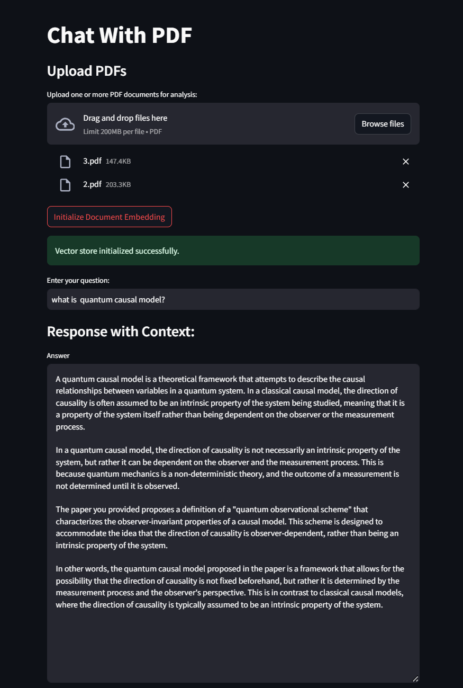
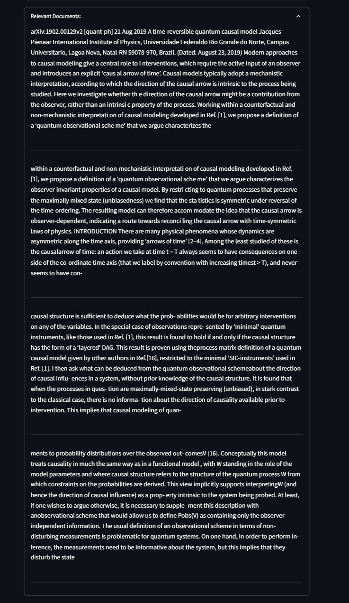

# Chat With PDF

This is a Streamlit-based application that allows users to interact with PDF documents using a conversational interface. The app is designed to retrieve and present relevant information from uploaded PDF documents based on user queries. It leverages **LangChain**, **FAISS**, **Google Generative AI embeddings**, and **ChatGroq** with **Llama3** to enable a seamless question-answering experience.

---

## Features

1. **Upload Multiple PDFs**:
   - Users can upload one or more PDF documents for analysis.

2. **Document Embedding**:
   - PDF content is converted into vector embeddings using Google Generative AI embeddings for efficient retrieval.

3. **Text Splitting**:
   - PDF text is processed into smaller chunks using a recursive character text splitter for better context retrieval.

4. **Conversational Interface**:
   - Users can ask questions, and the app retrieves relevant information from the uploaded PDFs and generates an answer.

5. **Contextual Responses**:
   - Answers are provided with context, and users can explore the most relevant document content.

6. **Deployed on Streamlit Community Cloud**:
   - The app is hosted on Streamlit Community Cloud for easy access and sharing.

---

## Setup and Deployment

### Prerequisites

1. Python 3.9+
2. Streamlit
3. Libraries: `langchain`, `faiss`, `google-generative-ai`, `groq`, `PyPDFLoader`
4. API Keys:
   - Google API Key for embeddings.
   - Groq API Key for ChatGroq integration.

### Installation

1. **Clone the Repository**:
   ```bash
   git clone https://github.com/your-repo/chat-with-pdf.git
   cd chat-with-pdf
   ```

2. **Install Dependencies**:
   ```bash
   pip install -r requirements.txt
   ```

3. **Set API Keys**:
   - Add `GOOGLE_API_KEY` and `GROQ_API_KEY` to your `secrets.toml` file under the `.streamlit` directory:
     ```toml
     [secrets]
     GOOGLE_API_KEY = "your-google-api-key"
     GROQ_API_KEY = "your-groq-api-key"
     ```

4. **Run the Application**:
   ```bash
   streamlit run app.py
   ```

5. **Deploy on Streamlit Community Cloud**:
   - Follow the instructions on [Streamlit Community Cloud](https://streamlit.io/cloud) to deploy your app.

---


## Screenshots






---


## Technical Details

- **Language Model**: Uses ChatGroq with the `Llama3-8b-8192` model for generating answers.
- **Embeddings**: Google Generative AI embeddings (`models/embedding-001`).
- **Vector Store**: FAISS is used for efficient similarity search and retrieval.
- **Document Loader**: PyPDFLoader for extracting text from PDF files.
- **Text Splitter**: RecursiveCharacterTextSplitter to handle large documents and ensure relevant chunking.

---

## License

This project is licensed under the MIT License. See the `LICENSE` file for details.


